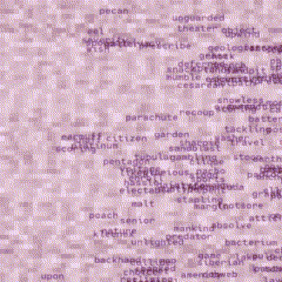

# anxvis ᓚ₍ ^. .^₎

an ethereal audio **vis**ualizer. the sky is full of **anx**ious words.



## get

use one of the following build systems:

### poetry
```
$ poetry install
$ poetry run anxvis <input.flac> <output.mp4>
```

### nix
make sure to have flakes enabled
```
$ nix build
$ ./result/bin/anxvis
```

## use

input can be any common audio file, output is an mp4 video
```
$ anxvis [-h] [-t FONT] [-f FPS] [-s SCALE] INPUT OUTPUT
```

## contribute

send patches to [the mailing list](https://lists.sr.ht/~nixgoat/public-inbox). prefix patches with "[PATCH anxvis]"

see [the guide to `git send-email`](https://git-send-email.io/) if this is your first time using sourcehut

## license

anxvis is licensed under the gnu general public license, version 3 or later. refer to [the license](LICENSE) for details

